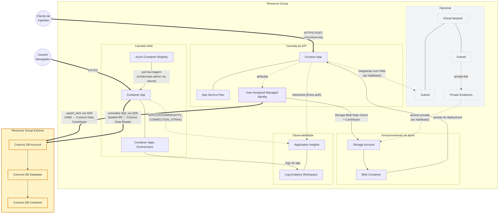

# DevOps Agentico de ponta a ponta com Azure MCP — Publicar, Fortalecer, Quebrar, Investigar

**Lab pratico (75 min) | Nivel: 300 | LAB501**

A IA pode implantar seu app no Azure em 5 minutos. Mas voce deve confiar no que ela construiu? Neste lab, voce vai usar o GitHub Copilot CLI com skills do Azure para implantar um Container App em producao real — uma aplicacao Python Flask que navega por um catalogo de conjuntos LEGO com dados no Azure Cosmos DB — junto com uma Function App que faz upsert de novos conjuntos LEGO no Cosmos DB. Depois, voce vai colocar o chapeu de arquiteto e avaliar as decisoes da IA. Voce vai revisar os arquivos Bicep gerados, identificar o que falta para prontidao de producao, orientar a IA a fortalecer o deployment, quebrar o app de proposito e executar uma investigacao forense completa — tudo sem abrir o Azure Portal.

> 💡 **As respostas da IA podem variar** em relacao ao que esta descrito neste guia. Foque em quais skills ativam e nos padroes de raciocinio, nao na saida exata. Os prompts foram testados, mas IA e nao deterministica — seus resultados podem ficar um pouco diferentes.

### Arquitetura Alvo

## O que voce vai aprender

- Como as **skills** do Azure se encadeiam — um prompt pode acionar `prepare` → `validate` → `deploy` automaticamente
- Onde a infraestrutura gerada por IA te leva a 80% — e quais lacunas de producao voce precisa fechar
- Como revisar criticamente Bicep, Dockerfiles e diagramas de arquitetura gerados por IA
- Como `azure-diagnostics` raciocina sobre problemas: padroes de triagem, correlacao de logs, geracao de KQL
- Quando confiar nas decisoes da IA e quando sobrescreve-las
- Como conectar um app em container a um Azure Cosmos DB pre-provisionado usando managed identity

## Skills usadas — 6 skills em 4 cenarios

| # | Skill | O que faz | Cenario |
|---|---|---|---|
| 1 | `azure-prepare` | Lida com dois pontos de partida em uma passada: envolve o codigo Flask existente com IaC + configuracao (Container Apps) **e** busca um template Python do Azure Functions e o adapta ao prompt (Flex Consumption) | 1A: Publicar |
| 2 | `azure-validate` | Verificacoes pre-flight: compilacao de Bicep, status do Docker (Container Apps), runtime Python + disponibilidade de Flex Consumption (Functions), acesso a subscription | 1A: Publicar |
| 3 | `azure-deploy` | Executa `azd up` — provisiona infraestrutura + build + deploy dos dois servicos (Flask Container App e Python Function App) | 1A: Publicar |
| 4 | `azure-rbac` | Encontra papeis de menor privilegio na documentacao Azure e gera comandos de atribuicao | 1B: Fortalecer |
| 5 | `azure-resource-visualizer` | Consulta o Resource Graph, mapeia relacoes e gera diagramas Mermaid | 2: Visualizar |
| 6 | `azure-diagnostics` | Coleta logs do sistema, segue cadeia de raciocinio diagnostico ate a causa raiz; escreve consultas KQL e cria regras de alerta | 3: Quebrar, 4: Investigar |

> 📖 **Glossario:** **ACR** = Azure Container Registry (repositorio privado de imagens Docker). **AZD** = Azure Developer CLI (`azd`). **Bicep** = linguagem IaC do Azure. **Cosmos DB** = banco NoSQL globalmente distribuido do Azure. **KQL** = Kusto Query Language (consultas de logs). **MCP** = Model Context Protocol.

## Secoes do lab

| # | Secao | Arquivo | Duracao |
|---|---------|------|----------|
| 1 | [Pre-requisitos](01-prerequisites.md) | `01-prerequisites.md` | Pre-sessao |
| 2 | [Login e Inicializacao](02-login-and-launch.md) | `02-login-and-launch.md` | ~5 min |
| 3 | [Configurar o App Inicial](03-getting-started.md) | `03-getting-started.md` | ~5 min |
| 4 | [Cenario 1 — Publicar e Fortalecer](04-scenario-1-ship-and-harden.md) | `04-scenario-1-ship-and-harden.md` | ~25 min |
| 5 | [Cenario 2 — Visualizar e Avaliar](05-scenario-2-see-and-evaluate.md) | `05-scenario-2-see-and-evaluate.md` | ~10 min |
| 6 | [Cenario 3 — Quebrar e Triar](06-scenario-3-break-and-triage.md) | `06-scenario-3-break-and-triage.md` | ~10 min |
| 7 | [Cenario 4 — Investigar e Operacionalizar](07-scenario-4-investigate-and-operationalize.md) | `07-scenario-4-investigate-and-operationalize.md` | ~15 min |
| 8 | [Solucao de Problemas](08-troubleshooting.md) | `08-troubleshooting.md` | Referencia |
| 9 | [Proximos Passos](09-whats-next.md) | `09-whats-next.md` | Referencia |
